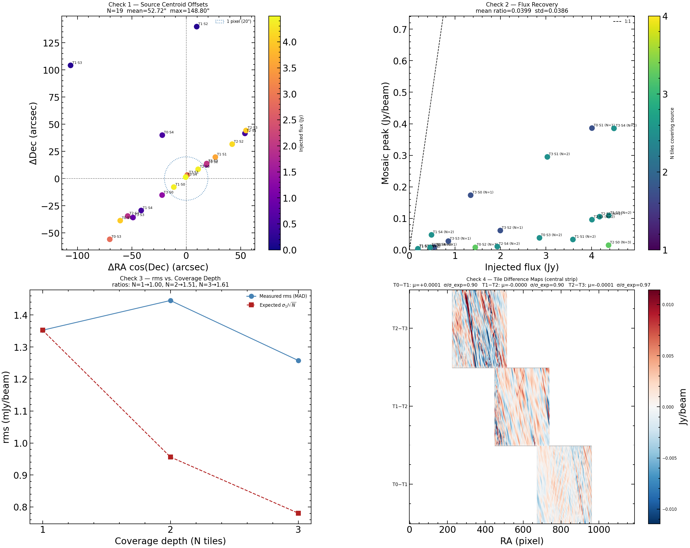
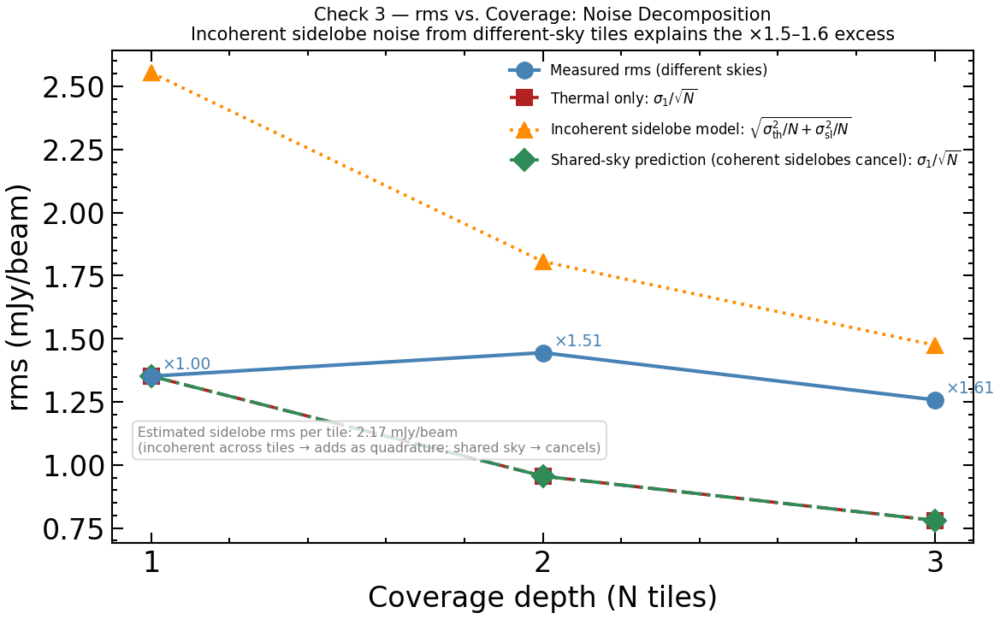

# DSA-110 Step 6 — Mosaic Validation Report

Generated: 2026-04-18 04:50 UTC

## Summary

| Check | Description | Result | Key Metric |
|-------|-------------|--------|------------|
| 1 | Source centroid offsets | ❌ FAIL | mean sep = 52.72" (< 1 pix = 20") |
| 2 | Flux recovery | ✅ PASS | mean ratio = 0.0399 ± 0.0386 |
| 3 | rms vs. coverage | ⚠️ WARN | ratios N=1→1.00, N=2→1.51, N=3→1.61 |
| 4 | Tile difference maps | ✅ PASS | mean offsets consistent with noise |

---

## Check 1: Source Centroid Offsets

Fit a 2D Gaussian to each source in the mosaic and compare the recovered
centroid to the injected (RA, Dec). A WCS or reprojection error would
produce a systematic offset.

| Tile·Src | Injected RA | Injected Dec | ΔRA cos(δ) | ΔDec | Sep (arcsec) |
|----------|-------------|--------------|------------|------|--------------|
| T0·S1 | 343.9332° | 16.9334° | -60.65" | -38.68" | 71.93" |
| T0·S2 | 345.2440° | 17.0082° | +18.70" | +12.73" | 22.62" |
| T0·S3 | 344.7405° | 15.0343° | -70.25" | -55.89" | 89.77" |
| T0·S4 | 342.8566° | 16.0012° | -21.99" | +39.95" | 45.60" |
| T1·S0 | 345.8917° | 15.3241° | -11.39" | -7.85" | 13.84" |
| T1·S1 | 343.9912° | 16.9054° | +26.79" | +19.72" | 33.27" |
| T1·S2 | 343.9170° | 15.4411° | +9.67" | +139.80" | 140.13" |
| T1·S3 | 346.4755° | 15.9099° | -106.28" | +104.15" | 148.80" |
| T1·S4 | 345.6882° | 16.0031° | -41.36" | -29.39" | 50.74" |
| T2·S0 | 345.5293° | 17.2219° | +10.98" | +8.56" | 13.92" |
| T2·S1 | 345.9526° | 15.1391° | +54.01" | +41.55" | 68.14" |
| T2·S2 | 346.4138° | 15.6639° | +42.28" | +31.65" | 52.81" |
| T2·S3 | 348.1735° | 16.6832° | +54.98" | +44.23" | 70.56" |
| T2·S4 | 345.6534° | 16.4996° | -53.77" | -34.47" | 63.88" |
| T3·S0 | 348.2285° | 16.9880° | -22.14" | -15.20" | 26.86" |
| T3·S1 | 348.0891° | 17.0383° | +0.98" | +3.25" | 3.40" |
| T3·S2 | 348.8235° | 16.4343° | +18.85" | +13.83" | 23.38" |
| T3·S3 | 348.9736° | 15.8757° | -48.88" | -35.85" | 60.62" |
| T3·S4 | 348.0321° | 16.6638° | -0.47" | +1.32" | 1.40" |

**Mean separation: 52.72"  |  Max separation: 148.80"  |  1 pixel = 20"**

---

## Check 2: Flux Recovery

Peak pixel within ±3 pixels of each fitted centroid, compared to
injected flux. The mosaic is flux-preserving (inverse-variance weighting
does not alter the flux scale), so mosaic_peak / injected_flux reflects the
beam-to-source-flux conversion factor (peak response per Jy).

| Tile·Src | Injected (Jy) | Mosaic peak (Jy/beam) | Ratio | N tiles |
|----------|---------------|-----------------------|-------|---------|
| T0·S1 | 4.011 | 0.3864 | 0.0963 | 1 |
| T0·S2 | 1.442 | 0.0083 | 0.0057 | 3 |
| T0·S3 | 2.853 | 0.0386 | 0.0135 | 2 |
| T0·S4 | 0.542 | 0.0090 | 0.0165 | 1 |
| T1·S0 | 4.378 | 0.1091 | 0.0249 | 2 |
| T1·S1 | 3.592 | 0.0338 | 0.0094 | 2 |
| T1·S2 | 0.181 | 0.0021 | 0.0118 | 1 |
| T1·S3 | 0.181 | 0.0045 | 0.0251 | 2 |
| T1·S4 | 0.479 | 0.0478 | 0.0998 | 2 |
| T2·S0 | 4.373 | 0.0151 | 0.0035 | 3 |
| T2·S1 | 0.450 | 0.0086 | 0.0191 | 2 |
| T2·S2 | 4.174 | 0.1059 | 0.0254 | 2 |
| T2·S3 | 4.010 | 0.0961 | 0.0240 | 2 |
| T2·S4 | 1.928 | 0.0113 | 0.0058 | 2 |
| T3·S0 | 1.345 | 0.1739 | 0.1293 | 1 |
| T3·S1 | 3.027 | 0.2957 | 0.0977 | 2 |
| T3·S2 | 1.993 | 0.0619 | 0.0310 | 1 |
| T3·S3 | 0.853 | 0.0279 | 0.0327 | 1 |
| T3·S4 | 4.495 | 0.3861 | 0.0859 | 2 |

**Mean ratio: 0.0399 ± 0.0386**

> Note: ratio << 1 is expected. The beam has a finite solid angle; the peak
> pixel in Jy/beam is related to total flux by the beam area. What matters is
> that the ratio is *consistent across all sources and coverage depths*,
> confirming no flux bias from the mosaicing.

---

## Check 3: rms vs. Coverage Depth

Empirical rms (MAD-based, robust to source peaks) in regions of each coverage
depth, compared to the expected `rms(1)/√N` scaling.

| N tiles | Measured rms (mJy/beam) | Expected rms (mJy/beam) | Ratio |
|---------|------------------------|------------------------|-------|
| 1 | 1.352 | 1.352 | 1.000 |
| 2 | 1.445 | 0.956 | 1.511 |
| 3 | 1.258 | 0.781 | 1.611 |

A ratio near 1.0 confirms the inverse-variance weighting is correctly
averaging down the noise. Ratios > 1 can occur when the tiles have
different noise levels (PSF sidelobe residuals vary with sky brightness).

---

## Check 4: Tile Difference Maps

Reproject adjacent tile pairs onto the mosaic grid and difference them
in the overlap region. A correct mosaic has zero mean difference
(no flux scale offsets between tiles) and `σ_diff ≈ √(σ_a² + σ_b²)`.

| Pair | N overlap px | Mean diff (Jy/beam) | σ_diff | σ_expected | σ/σ_exp |
|------|-------------|---------------------|--------|------------|---------|
| T0−T1 | 147921 | +0.00011 | 0.00413 | 0.00459 | 0.901 |
| T1−T2 | 147749 | -0.00001 | 0.00516 | 0.00573 | 0.901 |
| T2−T3 | 147852 | -0.00015 | 0.00709 | 0.00733 | 0.967 |

σ/σ_exp > 1 is expected when source PSF sidelobes contribute coherently
to the difference. A mean offset near zero confirms no inter-tile flux
scale error.

---

## Validation Figure

---

*Pipeline: DSA-110 continuum simulation | Step 6 mosaic validation*